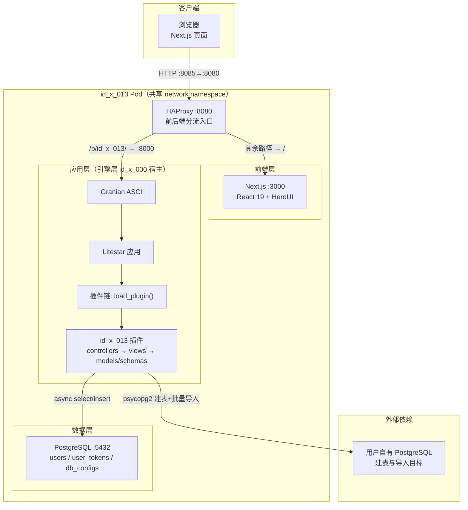
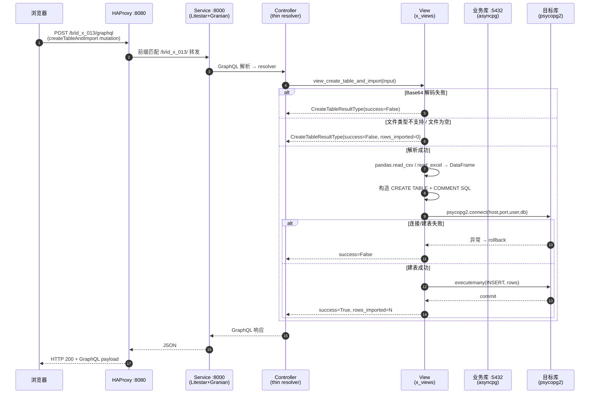

<div align="center">

# id_x_013

基于 Litestar + Strawberry GraphQL 的 Excel/CSV 数据导入工具插件，上传文件即可在用户自有的 PostgreSQL 数据库中自动建表并批量入库。


</div>

## 1 项目简介

### 1.1 Slogan

上传一份 Excel/CSV，自动在你的 PostgreSQL 中建表并导入——一个面向数据治理场景的零代码入库插件。

### 1.2 Description

id_x_013 是 i-Torch（引擎层 id_x_000）插件体系下的一个数据导入工具插件。它解决的核心问题是：业务人员拿到任意结构的表格文件后，无需编写 SQL 或脚本，即可在自身授权的 PostgreSQL 数据库中完成"建表 + 导入 + 字段注释"的完整闭环。

项目以 GraphQL（Strawberry）对外暴露统一端点，内部严格遵循"控制器(thin resolver) → 视图(business logic) → 模型(ORM) / 契约(schema)"四层分层。插件通过 `x_plugin.py` 暴露的 `load_plugin()` 钩子接入引擎层，主程序仅依赖 `PluginInterface` 契约，不感知插件内部包结构，实现纯粹解耦。

与同类导入工具相比，id_x_013 的差异化在于：模型表仅使用基础 SQL 类型（Integer/String/Text/DateTime/Boolean），不依赖 pgcrypto 或 pgvector，建表扩展依赖为零；同时以同一 Pod 内四容器（db / service / web / haproxy）共享网络命名空间的方式部署，单一端口对外暴露，运维链路极短。

## 2 核心特性

- 文件解析：支持 `.csv` / `.xlsx` / `.xls` 三种格式，基于 pandas 自动推断字段类型并返回前 3 行样本值。
- 自动建表：按用户传入的字段定义（名称 / 类型 / 注释）在目标 PostgreSQL 中执行 `CREATE TABLE IF NOT EXISTS`，并附加表级与列级 `COMMENT`。
- 批量入库：以参数化 `INSERT ... executemany` 批量写入，NaN 自动转 `NULL`，缺失列以 `NULL` 填充。
- 认证闭环：提供注册（默认未激活）/ 登录 / 忘记密码 / 登出 的令牌认证链路，令牌 24 h 过期。
- 引擎解耦：通过 `PluginInterface` 契约接入 id_x_000 引擎，`required_extensions` 为空元组，建表零扩展依赖。

## 3 项目亮点

1. **插件契约解耦** —— 主程序仅 import `x_models._contracts.PluginInterface`，通过 `load_plugin()` 获取实例并依次调用 `base` / `set_session_maker` / `required_extensions` / `build_tables` 四个钩子；插件内部 models/controllers 不被主程序直接 import，保证插件解耦的纯粹性。
2. **懒加载 ORM 元数据** —— `_Idx009Plugin.base` 采用 `@property` 懒加载，避免主程序加载插件时立即触发尚未就绪的 ORM 注册链；会话工厂由引擎层在 Litestar 启动后注入，避免循环依赖。
3. **四层分层严格分离** —— 控制器层仅做参数透传与路由，不含任何业务逻辑或数据库操作；业务逻辑统一收敛于 `src/views/x_views.py` 的 `view_*` 函数；异常在视图内部捕获并转换为业务响应，控制器层不再 `try/except`。
4. **零扩展依赖建表** —— 模型表刻意只用基础 SQL 类型，`required_extensions` 返回空元组，建表流程不依赖 pgcrypto / pgvector，降低了目标数据库的版本与扩展要求。
5. **同 Pod 四容器部署** —— db / service / web / haproxy 共享 network namespace，彼此经 `127.0.0.1` 互访，仅 haproxy 经 Pod 端口映射暴露到宿主机（8085 → 8080），对外只暴露单一端口，内网通信无加密开销。
6. **流量按前缀精确分流** —— HAProxy 以 `path_beg /b/id_x_013/` 区分前后端：API 流量转发至 service:8000，其余转发至 web:3000；大文件导入（base64 膨胀）后端 `timeout server` 单独放宽至 600 s。
7. **参数化批量写入** —— 数据导入使用 `cursor.executemany` 配合 `%s` 占位符，规避 SQL 注入；缺失列以 `None` 填充、NaN 转 `NULL`，保证入库鲁棒性。

## 4 技术栈

表1 id_x_013 技术栈一览

| 分类 | 名称 | 版本 | 用途 |
|---|---|---|---|
| 编程语言 | Python | >= 3.10 | 后端业务与 ORM |
| 编程语言 | TypeScript | ^5 | 前端类型系统 |
| 核心框架（后端） | Litestar | latest | ASGI Web 框架，承载 GraphQL 路由 |
| 核心框架（后端） | Strawberry GraphQL | latest | GraphQL schema 与 resolver |
| 核心框架（后端） | Granian | latest | ASGI 服务器，运行引擎层 main |
| 核心框架（后端） | SQLAlchemy | latest | 异步 ORM，声明式模型 |
| 核心框架（后端） | Advanced Alchemy | latest | SQLAlchemy 会话与事务增强 |
| 核心框架（前端） | Next.js | 16.2.3 | React 全栈框架 |
| 核心框架（前端） | React | 19.2.4 | UI 运行时 |
| UI 组件库 | HeroUI React | ^3.2.2 | 前端组件库 |
| 样式工具 | Tailwind CSS | ^4 | 原子化 CSS |
| 动效库 | Framer Motion | ^12.42.2 | 前端动画 |
| 数据库/存储 | PostgreSQL | 18 | 业务库与目标入库库 |
| 驱动 | asyncpg | latest | 异步 PostgreSQL 驱动 |
| 驱动 | psycopg2 | latest | 同步驱动，建表与批量导入 |
| 数据处理 | pandas | latest | Excel/CSV 解析与类型推断 |
| 数据处理 | openpyxl | latest | xlsx/xls 引擎后端 |
| 构建/编排 | Podman + podman-compose | latest | 四容器同 Pod 部署 |
| 反向代理 | HAProxy | 3.0 | 前后端流量分流入口 |

## 5 整体架构图



图1 id_x_013 整体架构（自上至下分层）

## 6 请求流转图

以"上传文件并建表导入"一次完整 GraphQL Mutation 为例：



图2 createTableAndImport 请求生命周期

## 7 目录结构

```text
id_x_013/                     插件根目录
├── x_plugin.py               插件对外统一入口，实现 PluginInterface 钩子
├── pyproject.toml            uv 构建配置与元数据
├── requirements.txt          运行期 Python 依赖
├── LICENSE                   AGPL-3.0 协议全文
├── src/                      插件本体源码
│   ├── controllers/
│   │   └── x_controllers.py  GraphQL thin resolver，Query/Mutation 定义
│   ├── views/
│   │   └── x_views.py        业务逻辑层，view_* 函数
│   ├── models/
│   │   └── x_models.py       SQLAlchemy ORM 模型与会话工厂
│   └── schemas/
│       └── x_schemas.py      Strawberry GraphQL 类型与 Input 定义
├── web/                      Next.js 前端工程
│   ├── src/
│   │   ├── app/              Next.js App Router（含 /f 路由）
│   │   ├── components/       React 组件
│   │   ├── views/            页面视图
│   │   ├── context/          全局上下文
│   │   ├── hooks/            自定义 Hooks
│   │   ├── layout/           布局组件
│   │   ├── api/              前端 API 封装
│   │   └── utils/            工具函数
│   ├── package.json          前端依赖与脚本
│   └── Dockerfile            前端镜像构建
├── ops/                      部署编排
│   ├── podman-compose.yml    四容器同 Pod 编排
│   ├── Dockerfile.service    后端服务镜像
│   ├── haproxy.cfg           流量分流配置
│   ├── up.sh / down.sh       一键启停脚本
│   ├── .env.example          环境变量示例
│   └── init/                 PostgreSQL 初始化脚本
└── docs/                     文档目录
```

## 8 API 接口文档

项目对外仅暴露一个 GraphQL 端点：`POST /b/id_x_013/graphql`。下表汇总全部 Query/Mutation 操作。

表2 GraphQL 操作汇总

| 类型 | 操作名 | 说明 | 鉴权 |
|---|---|---|---|
| Query | health | 健康检查 | 否 |
| Query | getDbConfig | 获取默认数据库连接配置 | 是 |
| Mutation | login | 用户登录，返回令牌 | 否 |
| Mutation | register | 用户注册（默认未激活） | 否 |
| Mutation | forgotPassword | 生成密码重置令牌 | 否 |
| Mutation | logout | 用户登出 | 是 |
| Mutation | parseFile | 解析上传文件，返回字段信息 | 是 |
| Mutation | createTableAndImport | 在目标库建表并批量导入 | 是 |

### 8.1 Query

#### 8.1.1 health

健康检查，返回服务状态。

入参：无。出参：`HealthType { status, service }`。鉴权：否。

```graphql
query { health { status service } }
```

#### 8.1.2 getDbConfig

获取默认或首条数据库连接配置。

入参：无。出参：`DbConfigType { id name host port username password database is_default }`，无记录时返回 `null`。鉴权：是（需携带有效令牌）。

### 8.2 Mutation

#### 8.2.1 login

入参 `LoginInput { email, password }`；出参 `AuthResponseType { success message token expires_at user { id email phone created_at } }`。令牌有效期 24 h。鉴权：否。

#### 8.2.2 register

入参 `RegisterInput { email, password, confirm_password, phone? }`；密码不少于 6 位。注册后 `is_active=False`，需管理员激活。鉴权：否。

#### 8.2.3 forgotPassword

入参 `ForgotPasswordInput { email }`；出参 `ForgotPasswordResponseType { success message reset_token? }`。重置令牌有效期 1 h；生产环境应改为邮件发送而非直接返回。鉴权：否。

#### 8.2.4 logout

入参：无。出参 `AuthResponseType { success message }`。鉴权：是。

#### 8.2.5 parseFile

解析上传的 Excel/CSV 文件并返回字段信息。

入参：`file_data: String`（Base64 编码内容）、`filename: String`（用于判断扩展名）。
出参：`FileUploadResultType { success message fields { name dtype sample_values } }`。
异常：Base64 解码失败、不支持的文件类型、文件为空均以 `success=False` 返回。鉴权：是。

```graphql
mutation {
  parseFile(fileData: "<BASE64_DATA>", filename: "demo.xlsx") {
    success
    message
    fields { name dtype sampleValues }
  }
}
```

#### 8.2.6 createTableAndImport

在用户提供的 PostgreSQL 数据库中建表并批量导入数据。

入参 `CreateTableInput { table_name, table_comment?, fields { name dtype comment? }, host, port, username, password, database, file_data, filename }`。
出参 `CreateTableResultType { success message sql rows_imported }`。

字段说明：

- `fields[].dtype` 取 PostgreSQL 类型，如 `INTEGER` / `TEXT`，内部会 `upper()`。
- `file_data` 为 Base64 编码的原始文件内容。
- 建表语句为 `CREATE TABLE IF NOT EXISTS`；数据以参数化 `executemany` 写入。
- 任一步骤失败则 `success=False` 且 `rows_imported=0`，建表失败会触发 `rollback`。

鉴权：是。

### 8.3 调用示例

以下示例中需替换 `<BASE_URL>`（如 `http://127.0.0.1:8085`）、`<TOKEN>`（登录返回的令牌）、`<BASE64_DATA>`（文件 Base64 内容）。

登录取令牌：

```bash
curl -X POST '<BASE_URL>/b/id_x_013/graphql' \
  -H 'Content-Type: application/json' \
  -d '{"query":"mutation($i:LoginInput!){login(input:$i){success token user{id email}}}", \
       "variables":{"i":{"email":"a@b.com","password":"123456"}}}'
```

携带令牌解析文件：

```bash
curl -X POST '<BASE_URL>/b/id_x_013/graphql' \
  -H 'Content-Type: application/json' \
  -H 'Authorization: Bearer <TOKEN>' \
  -d '{"query":"mutation($d:String!,$f:String!){parseFile(fileData:$d,filename:$f){success fields{name dtype}}}", \
       "variables":{"d":"<BASE64_DATA>","f":"demo.csv"}}'
```

## 9 快速部署

### 9.1 环境准备

- Python >= 3.10（后端运行期）
- Node >= 24.0（前端构建，仅本地开发需要）
- PostgreSQL 18（业务库）
- Podman >= 4.0 与 podman-compose（容器编排，推荐方式）
- 宿主机端口 8085 空闲

### 9.2 安装

后端依赖（在仓库根 id_x_000 上下文）：

```bash
pip install -r x_models/id_x_013/requirements.txt
```

前端依赖：

```bash
cd x_models/id_x_013/web
npm install
```

### 9.3 运行

后端由引擎层 `main.py` 启动（Granian 托管 `main:obj`，监听 8000）：

```bash
python main.py
```

前端开发模式（监听 3000）：

```bash
cd x_models/id_x_013/web
npm run dev
```

### 9.4 容器部署

推荐使用 Podman 同 Pod 四容器部署，一条脚本完成构建与启动：

```bash
cd x_models/id_x_013/ops
cp .env.example .env          # 务必修改 POSTGRES_PASSWORD
./up.sh                       # 首次或镜像不存在时自动构建
```

`up.sh` 会依次：构建 service / web 镜像、创建 Pod（端口 8085:8080）、创建数据卷、按序启动 db → service → web → haproxy 并等待 db 健康检查通过。

停止与清理：

```bash
cd x_models/id_x_013/ops
./down.sh
```

或使用 podman-compose：

```bash
cd x_models/id_x_013/ops
podman pod create --name id_x_013 -p 8085:8080   # 首次创建 Pod
podman compose up -d --build
```

部署完成后访问 `http://<HOST>:8085`，前端页面默认重定向至登录页；GraphQL 端点位于 `http://<HOST>:8085/b/id_x_013/graphql`。如需 Kubernetes 部署，可将上述四容器以同一 Pod 模板迁移至 K8s，并用 `kubectl apply -f` 提交。
