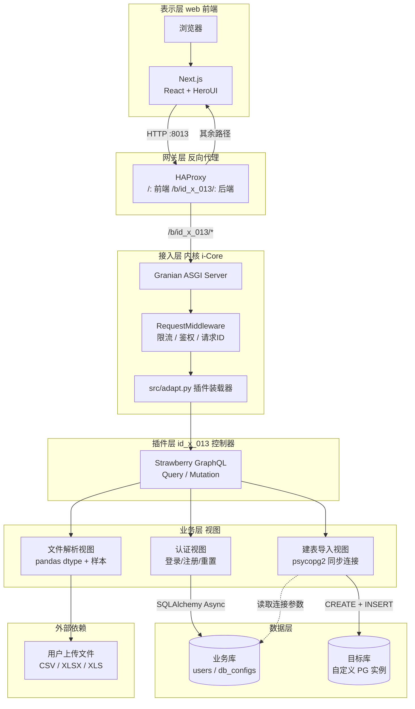
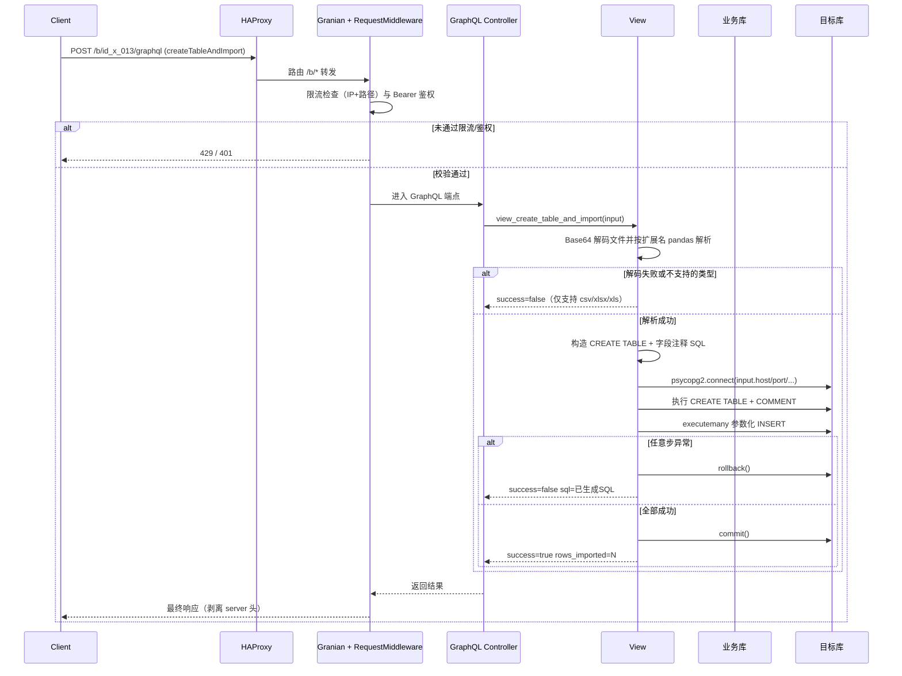

<div align="center">

# id_x_013: 数据导入工作台

**面向科研数据资产的 Excel/CSV 解析与 PostgreSQL 自动建表导入插件**


</div>

---

## 1. 简介 (Introduction)

- **Slogan**: 面向科研数据资产的 Excel/CSV 解析与 PostgreSQL 自动建表导入插件。
- **Description**: id_x_013 是 i-Core 可插拔业务模块集成运行时内核的业务插件，定位为「上传即入库」的数据导入工作台。插件通过 `PluginInterface` 契约挂载到内核，对外暴露 GraphQL 端点，对内遵循「控制器薄转发 → 视图承载业务 → 模型固化数据 → 模式声明契约」四层分层，覆盖用户登录、文件解析、目标库连接、自动建表、批量导入与表/字段注释生成的完整链路。针对科研数据汇集中的「Excel/CSV 字段人工建表烦琐、字段类型易错、导入脚本难复用、多目标库无统一入口」等痛点，插件以 pandas 推断字段样本、用户自定义 PostgreSQL 类型、参数化 `executemany` 批量写入、单事务回滚给出可复现方案，相较手工 `COPY` 或独立脚本式方案具备更强的字段校验闭环与目标库可插拔能力，适用于实验数据归档、问卷批次入库、多库归集等场景。

## 2. 核心特性 (Features)

- GraphQL 端点：基于 Strawberry 暴露查询（Query）/变更（Mutation）两类操作，统一前缀 `/b/id_x_013/graphql`，受内核 Bearer 鉴权中间件保护。
- 文件解析：基于 pandas 解析 CSV、XLSX、XLS 三类文件，返回字段名称、字段数据类型（dtype）与前 3 行样本值，供前端预校验。
- 自动建表与导入：依据用户传入的字段名与类型生成 `CREATE TABLE IF NOT EXISTS` 语句，附带表注释与字段注释；通过参数化 `executemany` 批量入库，导入异常时事务回滚。
- 目标库可插拔：导入接口内嵌主机、端口、用户名、密码、数据库名五项参数，单次请求即可指向任意可达 PostgreSQL 实例，与内核业务库物理隔离。
- 容器化双模部署：提供 `up.sh`（四容器同 Pod，共享网络命名空间）与 `compose.yaml`（bridge 网络 + 服务名互访）两套并存编排，仅反向代理暴露宿主机端口。

## 3. 项目亮点 (Highlights)

1. **零侵入插件契约接入** —— 仅需实现 `register_routers(prefix)` 与 `PluginInterface`（`build_tables` / `set_session_maker` / `required_extensions`），内核 `src/adapt.py` 动态装载路由与插件实例，接入不修改内核任何一行代码。
2. **薄控制器四层分层** —— 控制器（x_controllers.py）仅做参数透传，业务逻辑全部下沉至视图（x_views.py），控制器/视图/模型/模式职责单一，便于单元测试与替换。
3. **字段样本先行** —— `view_parse_file` 先解码 Base64 再按扩展名分流解析，输出字段 dtype 与前 3 行样本，前端可在导入前完成类型映射校对，避免脏数据落库。
4. **单事务回滚闭环** —— 建表、注释、批量 INSERT 共用同一 psycopg2 连接，任意步异常即 `rollback()` 并返回已生成的 SQL 供排错，最终 `finally` 关闭游标与连接。
5. **NaN 与 numpy 适配** —— 导入前逐值判 `pd.isna` 转 `None` 写 NULL，并通过 `v.item()` 将 numpy 标量转为原生 Python 类型，规避 psycopg2 无法适配 numpy.int64 等异常。
6. **会话工厂内核注入** —— 内核启动建表完成后将 `async_sessionmaker` 注入插件，插件无需自行管理连接池生命周期；业务库连接参数以加密值存于模块 `.env`，运行时自动解密。
7. **双模容器编排** —— 同 Pod 模式容器共享网络命名空间经 `127.0.0.1` 互访，compose 模式经 DNS 服务名互访；两种模式数据卷同名共用，HAProxy 统一在 `:8080` 终止并分流前后端流量。

## 4. 技术栈 (Tech Stack)

<p align="center">表 4-1 id_x_013 技术栈一览</p>

| 分类 | 名称 | 版本 | 用途 |
|------|------|------|------|
| 编程语言 | Python | ≥ 3.10 | 服务端主语言 |
| 编程语言 | TypeScript | ≥ 5.0 | 前端主语言 |
| 后端框架 | Litestar | ≥ 2.24 | ASGI 路由与中间件宿主 |
| 应用服务器 | Granian | ≥ 2.7 | Rust 内核 ASGI 服务器 |
| 接口协议 | Strawberry GraphQL | ≥ 0.323 | 查询/变更两类操作 |
| 数据库 | PostgreSQL | 18 | 业务库与导入目标库 |
| 同步驱动 | psycopg2 | ≥ 2.9 | 目标库建表与批量导入 |
| 异步驱动 | asyncpg + SQLAlchemy | ≥ 2.0 | 业务库异步会话 |
| 数据解析 | pandas + openpyxl | — | CSV/XLSX/XLS 解析 |
| 前端框架 | Next.js | 16.2.3 | React 服务端渲染 |
| UI 组件 | HeroUI + Tailwind CSS | ^3.2 / ^4 | 组件库与样式 |
| 反向代理 | HAProxy | 3.0 | 流量入口与路由分区 |
| 容器编排 | Podman / podman-compose | — | 四容器一体化部署 |

## 5. 整体架构图 (Overall Architecture Diagram)



<p align="center">图 5-1 id_x_013 分层架构图</p>

## 6. 请求流转图 (Request Flow Diagram)



<p align="center">图 6-1 id_x_013 请求流转图</p>

## 7. 目录结构 (Directory Structure)

```text
id_x_013/
├── x_plugin.py                 # 插件入口: load_plugin() 返回 PluginInterface 实例
├── requirements.txt            # Python 依赖清单（与内核 pyproject.toml 对齐）
├── .env.template               # 模块环境变量模板（业务库加密连接参数）
├── .env                        # 模块环境变量（DB_NAME 明文 + 加密连接参数）
├── LICENSE                     # AGPL-3.0 许可证
├── src/
│   ├── controllers/
│   │   └── x_controllers.py    # Strawberry Query/Mutation + register_routers
│   ├── views/
│   │   └── x_views.py          # 业务逻辑: 认证/文件解析/建表导入
│   ├── models/
│   │   └── x_models.py         # SQLAlchemy ORM: User/UserToken/DbConfig 等
│   └── schemas/
│       └── x_schemas.py        # Strawberry 类型: LoginInput/CreateTableInput 等
├── web/                        # Next.js 前端
│   ├── package.json            # next 16.2.3 / react 19 / HeroUI
│   ├── next.config.ts          # Next.js 配置
│   ├── Dockerfile              # 前端镜像构建（Node 24 两阶段）
│   ├── src/                    # 前端源码（app/components/api/utils）
│   └── public/                 # 静态资源
├── ops/
│   ├── up.sh / down.sh         # 同 Pod 四容器创建/销毁脚本（方式一）
│   ├── compose.yaml            # compose 编排（bridge 网络，方式二）
│   ├── Dockerfile.service      # 后端镜像构建（上下文为 i-Core 仓库根）
│   ├── haproxy.cfg             # HAProxy 配置（同 Pod，127.0.0.1 互访）
│   ├── haproxy.compose.cfg     # HAProxy 配置（compose，服务名互访）
│   ├── .env.example            # 部署环境变量模板
│   └── init/                   # PostgreSQL 初始化脚本（幂等）
│       ├── 01_init.sql         # 建库与基础表
│       └── 02_db_config.sql    # 默认数据库配置行
└── docs/                       # 文档目录
```

## 8. API 接口文档 (API Documentation)

id_x_013 对外接口由 `register_routers` 统一注册至内核 `/b/id_x_013` 前缀下，受内核 `RequestMiddleware` 的 Bearer 鉴权保护（模块前缀路径默认在免鉴权白名单中，按内核配置生效）。

<p align="center">表 8-1 接口汇总</p>

| 方法 | 路径 | 鉴权 | 说明 |
|------|------|------|------|
| POST | `/b/id_x_013/graphql` | Bearer | GraphQL 查询/变更主入口 |

### 8.1 GraphQL 查询 (Query)

- `health`：健康检查，返回 `{ status: "ok", service: "id_x_013" }`。
- `getDbConfig`：获取默认数据库连接配置，优先取 `db_configs` 表 `is_default` 行，无默认则回退首行。

### 8.2 GraphQL 变更 (Mutation)

- `login(input: LoginInput!)`：用户登录，校验密码哈希后签发令牌入库 `user_tokens`，24 小时过期，返回 `AuthResponseType`。
- `register(input: RegisterInput!)`：用户注册，两次密码一致性校验，邮箱去重，默认 `is_active=false` 待管理员激活。
- `forgotPassword(input: ForgotPasswordInput!)`：忘记密码，旧令牌置 `used=true` 后签发 1 小时令牌。
- `logout`：登出，返回成功响应。
- `parseFile(fileData: String!, filename: String!)`：解析上传文件，Base64 解码后按扩展名分流至 pandas，返回字段名称/dtype/前 3 行样本，仅接受 `.csv`/`.xlsx`/`.xls`。
- `createTableAndImport(input: CreateTableInput!)`：在目标 PostgreSQL 实例建表并导入数据。`CreateTableInput` 含 `tableName`、`tableComment`、`fields`（每字段含 `name`/`dtype`/`comment`）、目标库连接五参、`fileData`（Base64 编码文件）、`filename`。返回 `CreateTableResultType{ success, message, sql, rowsImported }`。

### 8.3 调用示例

以下示例需替换占位符 `<BASE_URL>`、`<TOKEN>`、`<DB_HOST>` 等。

```bash
# 健康检查
curl -X POST "<BASE_URL>/b/id_x_013/graphql" \
  -H "Authorization: Bearer <TOKEN>" \
  -H "Content-Type: application/json" \
  -d '{ "query": "{ health { status service } }" }'

# 解析文件（file_data 需先 Base64 编码）
curl -X POST "<BASE_URL>/b/id_x_013/graphql" \
  -H "Authorization: Bearer <TOKEN>" \
  -H "Content-Type: application/json" \
  -d '{
    "query": "mutation($f: String!, $n: String!) { parseFile(fileData: $f, filename: $n) { success message fields { name dtype sampleValues } } }",
    "variables": { "f": "<BASE64_DATA>", "n": "sample.xlsx" }
  }'

# 建表并导入
curl -X POST "<BASE_URL>/b/id_x_013/graphql" \
  -H "Authorization: Bearer <TOKEN>" \
  -H "Content-Type: application/json" \
  -d '{
    "query": "mutation($i: CreateTableInput!) { createTableAndImport(input: $i) { success message sql rowsImported } }",
    "variables": {
      "i": {
        "tableName": "experiment_01",
        "tableComment": "实验一批次数据",
        "fields": [
          { "name": "id", "dtype": "INTEGER", "comment": "记录编号" },
          { "name": "value", "dtype": "REAL", "comment": "测量值" }
        ],
        "host": "<DB_HOST>",
        "port": 5432,
        "username": "<DB_USER>",
        "password": "<DB_PASSWORD>",
        "database": "<DB_NAME>",
        "fileData": "<BASE64_DATA>",
        "filename": "sample.csv"
      }
    }
  }'
```

未携带合法 Bearer Token 时由内核中间件返回：

```json
{"error": "Unauthorized access", "code": 401}
```

请求体大小上限由内核 `[BASE].MAX_REQUEST_BODY_SIZE` 控制，默认 1073741824 字节（1 GiB），满足 Base64 编码大文件上传需求。

## 9. 快速部署 (Quick Deploy)

### 9.1 环境准备 (Prerequisites)

- Python ≥ 3.10
- Node.js ≥ 24（前端构建，Next.js 16 建议 Node 24+）
- PostgreSQL ≥ 14（业务库，容器化部署默认采用 18）
- i-Core 内核已就绪（`uv sync` 完成依赖安装）
- Podman 与 podman-compose（容器化部署）

### 9.2 安装 (Installation)

```bash
# 在内核 x_models/ 下放置插件
cp -r id_x_013 <I_CORE_ROOT>/x_models/

# 在内核 config/base_config.toml 注册插件：
# [EXTEND]
# MODELS = [
#     ["id_x_013", "/id_x_013"],
# ]

# 配置模块业务库连接（加密值用内核 utils/encrypt_util.py 生成）
cp x_models/id_x_013/.env.template x_models/id_x_013/.env

# 前端依赖
cd x_models/id_x_013/web && npm install
```

### 9.3 运行 (Run)

```bash
# 启动后端（在内核根目录）
uv run python main.py        # 默认监听 0.0.0.0:7000

# 启动前端
cd x_models/id_x_013/web
npm run dev                  # 开发模式，默认 2000 端口
npm run build && npm start   # 生产模式
```

### 9.4 容器部署 (可选)

项目内置 Podman 四容器（数据库 / 服务 / 前端 / 反向代理）一体化编排，两套方式并存、请勿混用：

```bash
cd x_models/id_x_013/ops
cp .env.example .env   # 修改 POSTGRES_PASSWORD 等

# 方式一：同 Pod 四容器（共享网络命名空间，127.0.0.1 互访）
./up.sh                # 首次构建加 --build
podman pod ps
./down.sh              # 销毁 Pod 与容器（保留数据卷）

# 方式二：compose 编排（bridge 网络 + 服务名互访）
podman-compose up -d --build
podman-compose down
```

宿主机访问 `http://<HOST>:8013` 即可，HAProxy 监听容器内 `:8080`，经端口映射暴露到宿主机 `8013`（compose 模式可通过 `.env` 中 `POD_PORT` 覆盖）；compose 模式额外将数据库 `5432` 发布到宿主机 `54323`（`DB_HOST_PORT`），供外部工具直连。若使用 Kubernetes，可参考以下方式部署：

```bash
kubectl apply -f ops/deployment.yaml
kubectl rollout status deployment/id_x_013
```

部署清单需自行补全数据库连接 Secret、持久卷挂载与 `.env` 的 ConfigMap 映射。

---

## 参考文献

- [1] Strawberry GraphQL. Strawberry Framework Documentation[EB/OL]. https://strawberry.rocks, 2025.
- [2] Litestar Project. Litestar Framework Documentation[EB/OL]. https://docs.litestar.dev, 2025.
- [3] pandas development team. pandas Documentation[EB/OL]. https://pandas.pydata.org/docs, 2025.
- [4] Vercel. Next.js Documentation[EB/OL]. https://nextjs.org/docs, 2025.
- [5] PostgreSQL Global Development Group. PostgreSQL Documentation[EB/OL]. https://www.postgresql.org/docs, 2025.
