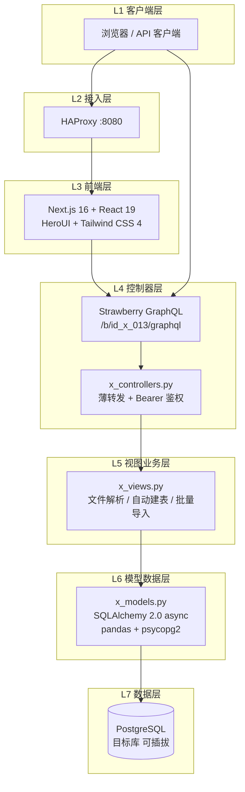
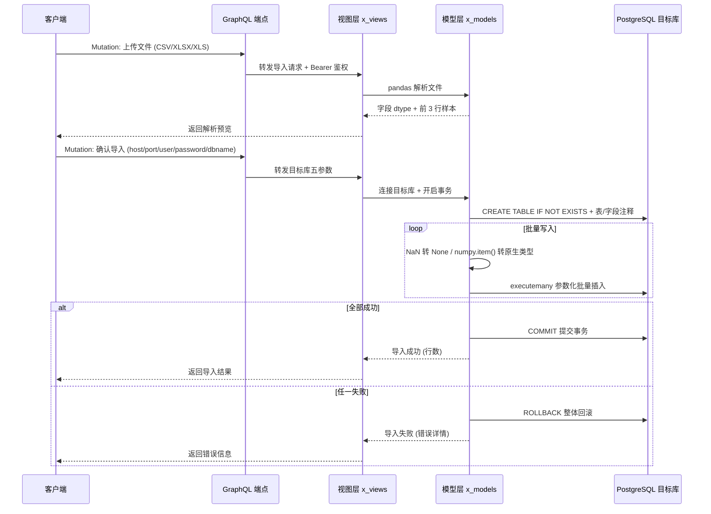

<div align="center">

# id_x_013: 数据导入工作台

**上传即入库 —— 面向科研数据资产的 Excel/CSV 解析与 PostgreSQL 自动建表导入插件**


</div>

---

## 1. 简介 (Introduction)

**上传即入库 —— 从文件到数据表，一步直达。**

id_x_013（数据导入工作台）是面向科研数据资产的 Excel/CSV 解析与 PostgreSQL 自动建表导入插件。上传即入库，覆盖文件解析、目标库连接、自动建表、批量导入与表/字段注释生成完整链路，帮助科研团队将散落的数据文件快速沉淀为可查询、可治理的数据库资产。

## 2. 核心特性 (Features)

- **GraphQL 统一端点**：基于 Strawberry GraphQL 提供 Query/Mutation 能力，单一 `/b/id_x_013/graphql` 端点承载全部交互
- **智能文件解析**：pandas 驱动解析 CSV/XLSX/XLS，自动返回字段 dtype 类型推断与前 3 行样本数据预览
- **自动建表与注释**：`CREATE TABLE IF NOT EXISTS` 自动生成目标表，并同步写入表级与字段级 COMMENT 注释
- **参数化批量导入**：基于 `executemany` 的参数化批量写入，兼顾性能与 SQL 注入防护
- **目标库可插拔**：host/port/user/password/dbname 五参数动态指定目标 PostgreSQL 库，导入目标随需切换

## 3. 项目亮点 (Highlights)

1. **完整入库链路**：从文件上传、解析预览、目标库连接、自动建表到批量导入、注释生成，一条链路闭环交付，无需人工建表
2. **NaN 与 numpy 类型适配**：`pd.isna` 自动转 `None`、`v.item()` 自动转 Python 原生类型，彻底解决 pandas 数据类型与 PostgreSQL 驱动的兼容性陷阱
3. **单事务回滚保障**：整批导入运行在单事务内，任一记录失败即整体回滚，杜绝半导入的脏数据状态
4. **会话工厂内核注入**：数据库会话工厂由内核统一注入，插件不持有连接细节，与平台运行时深度解耦
5. **四层分层架构**：控制器薄转发 → 视图业务 → 模型数据 → 模式契约，职责清晰、可测试、易演进
6. **双模容器编排**：同 Pod 共享网络模式（up.sh/down.sh）与 compose bridge 网络模式双轨并行，灵活适配不同部署拓扑
7. **Bearer 鉴权集成**：GraphQL 端点统一接入 Bearer Token 鉴权，与平台认证体系无缝衔接

## 4. 技术栈 (Tech Stack)

<div align="center">表 1 技术栈一览</div>

| 分类 | 名称 | 版本 | 用途 |
| --- | --- | --- | --- |
| 前端框架 | Next.js | 16.2.3 | React 全栈应用框架 |
| 前端框架 | React | 19 | UI 组件渲染 |
| 前端组件 | HeroUI | - | 组件库 |
| 前端样式 | Tailwind CSS | 4 | 原子化样式 |
| 后端引擎 | Litestar | - | ASGI Web 框架 |
| 后端服务器 | Granian | - | 高性能 ASGI 服务器 |
| API 层 | Strawberry GraphQL | - | GraphQL Query/Mutation |
| ORM | SQLAlchemy | 2.0 async | 异步数据访问 |
| 数据库驱动 | asyncpg | - | 异步 PostgreSQL 驱动 |
| 数据库驱动 | psycopg2 | - | 同步批量导入驱动 |
| 数据解析 | pandas | - | CSV/XLSX/XLS 解析 |
| 数据解析 | openpyxl | - | Excel 文件读写 |
| 数据库 | PostgreSQL | - | 目标数据存储 |
| 负载均衡 | HAProxy | - | :8080 流量入口 |

## 5. 整体架构图 (Overall Architecture Diagram)

<div align="center">图 1 整体架构图</div>



## 6. 请求流转图 (Request Flow Diagram)

<div align="center">图 2 导入请求流转图</div>



## 7. 目录结构 (Directory Structure)

```text
id_x_013/
├── __init__.py
├── x_plugin.py                # 插件入口
├── requirements.txt           # Python 依赖
├── LICENSE                    # AGPL-3.0
├── src/
│   ├── __init__.py
│   ├── controllers/
│   │   └── x_controllers.py   # 控制器层：薄转发 + 鉴权
│   ├── views/
│   │   └── x_views.py         # 视图层：业务编排
│   ├── models/
│   │   └── x_models.py        # 模型层：数据访问与导入逻辑
│   └── schemas/
│       └── x_schemas.py       # 模式层：GraphQL/Pydantic 契约
├── web/                       # 前端 (Next.js 16 + React 19)
│   ├── src/
│   ├── public/
│   ├── Dockerfile
│   ├── next.config.ts
│   ├── package.json
│   └── tsconfig.json
├── docs/                      # 文档
└── ops/                       # 运维编排
    ├── up.sh                  # 同 Pod 共享网络模式启动
    ├── down.sh                # 同 Pod 模式停止
    ├── compose.yaml           # compose bridge 网络模式
    ├── Dockerfile.service     # 后端镜像
    ├── haproxy.cfg            # HAProxy 配置 (同 Pod)
    ├── haproxy.compose.cfg    # HAProxy 配置 (compose)
    ├── init/                  # 初始化脚本
    └── .dockerignore
```

## 8. API 接口文档 (API Documentation)

### 端点

所有 API 通过统一的 GraphQL 端点暴露，需携带 Bearer Token 鉴权：

```text
POST /b/id_x_013/graphql
Authorization: Bearer <token>
Content-Type: application/json
```

### 操作一览

| 类型 | 操作 | 说明 | 关键入参 |
| --- | --- | --- | --- |
| Query | 解析文件预览 | 解析 CSV/XLSX/XLS，返回字段 dtype 与前 3 行样本 | 文件内容/标识 |
| Mutation | 创建目标连接 | 校验目标库五参数连通性 | host, port, user, password, dbname |
| Mutation | 自动建表 | CREATE TABLE IF NOT EXISTS + 表/字段注释 | 表名, 字段定义, 注释 |
| Mutation | 批量导入 | 参数化 executemany 批量写入，单事务回滚 | 表名, 数据行集 |
| Mutation | 生成注释 | 为已有表/字段生成 COMMENT | 表名, 注释映射 |

### 示例

解析文件预览：

```bash
curl -X POST http://localhost:8080/b/id_x_013/graphql \
  -H "Authorization: Bearer <token>" \
  -H "Content-Type: application/json" \
  -d '{
    "query": "query { parseFilePreview(fileId: \"abc123\") { fields { name dtype } sampleRows } }"
  }'
```

执行批量导入：

```bash
curl -X POST http://localhost:8080/b/id_x_013/graphql \
  -H "Authorization: Bearer <token>" \
  -H "Content-Type: application/json" \
  -d '{
    "query": "mutation { importData(target: {host: \"db.local\", port: 5432, user: \"researcher\", password: \"***\", dbname: \"lab\"}, table: \"sensor_data\", fileId: \"abc123\") { success insertedRows message } }"
  }'
```

## 9. 快速部署 (Quick Deploy)

### 前置依赖 (Prerequisites)

- Python 3.11+ 与 pip
- Node.js 20+ 与 npm
- PostgreSQL 14+（作为目标库）
- Docker 与 Docker Compose（容器化部署）

### 安装 (Installation)

```bash
# 后端依赖
pip install -r requirements.txt

# 前端依赖
cd web && npm install && cd ..
```

### 本地运行 (Run)

```bash
# 启动后端 (Litestar + Granian)
granian --interface asgi x_plugin:app --host 0.0.0.0 --port 8000

# 启动前端开发服务器
cd web && npm run dev
```

### 容器化部署 (Container Deploy)

方式一：同 Pod 共享网络模式

```bash
cd ops
./up.sh      # 启动全部服务
./down.sh    # 停止并清理
```

方式二：compose bridge 网络模式

```bash
cd ops
docker compose -f compose.yaml up -d --build
docker compose -f compose.yaml down
```

部署完成后，通过 HAProxy 统一入口访问：

```text
http://localhost:8080/b/id_x_013/graphql
```
